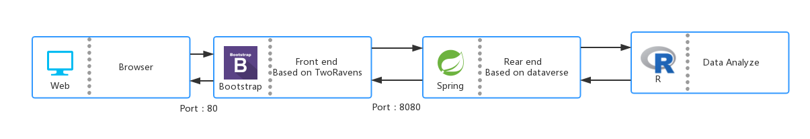

# High Level Design(概要设计规约)

## 1. 原型设计

### 1.1 初始界面

这个界面是整个项目的初始界面。整个界面由四部分组成：

- 第一部分是标题栏，上面显示了本次操作的数据集名称和一个`function`按钮，点击这个按钮可以看到很多擦操作选项，每个选项表示了对这套数据集要进行的操作。当然，灭个数据集都有自身的固有属性，选择变量少于所需、大于所需、不支持该运算的情况都会发生。此时，系统会弹出对话框表示该操作无效。若操作满足要求，则会出现一个新的变量（用一个圆圈表示）。
- 第二部分是左边栏——展示所有出现的变量的地方。这个栏会展示从tab文件中读取到的所有变量名和所操作后生成的变量名。点击每个变量，可以看到此变量的最大值 / 最小值 / 均值 / 方差等等很常用的统计数据信息（共8个）。
- 第三部分中间的大型界面，这个界面是对你想要操作的变量进行操作的控制台，没一个圆圈都表示一个变量，如果可能的话会在每个圆圈中展示二维柱状图显示变量信息。圆圈之间的连线表示计算的先后关系。此外为了简便操作，每个圆圈都是可以移动的。
- 第四部分是右边栏，是展示变量进阶数据的部分。这个部分会展示变量的一些进阶数据，包括二维坐标系展示每个变量的数据变换的柱状图等。

### 1.2 点击function界面 

#### 1.2.1 点击function

点击function按钮会出现一个下拉框，每个选项代表不同的数学操作。如果选择正确的变量和数学操作，就会根据操作生成新的变量。新的变量以圆圈的形式添加在展示频平台上，并会在左边栏里添加对应的变量名。如果操作不符合所选变量的话，系统会报错并显示提示信息。

#### 1.2.2 出现新的变量

如下图展示的是计算成功一以后展示栏上多出一个生成变量的情况。和其他正常的变量一样，名字会在左边栏上列出，也可以查看此变量的详细统计数据信息和柱状图.

### 1.3 单击变量出现概要数据

单击左栏的value 3。

可以看到一共有8个特征值：最小值，最大值，数量，类型，均值，方差等。每个变量都拥有这8个特征值，因为特征值是由tab所储存的统计信息计算得到的。

### 1.4 单击diagram选项查看图表

点击图表按钮，会出现每个变量所对应的二维图像。图像中y值代表数据大小，x轴代表数据出现的先后，每一个数据被化成柱状图，连在一起形成了变量变化的图像，可以表征变量变化特征。

## 2. 业务构架

我们的额系统构架共有两部分，三层组成：

- View层：显示层，负责给用户提供可操作的接口，包括图形化界面和url接口等
- Controller层：负责处理请求，进行分析，数据处理和转达
- Model层：用户操作的最底层的数据

而两部分构架分别是：

- 文件系统，负责相关文件的上传下载等
  - View层：负责文件下载，文件生成和文件上传，只要由符合要求的.tab文件，就能够进行相应操作。
  - Controller层：文件管理器，处理View层的请求：xml和prep文件有专门的读写控制器控制文件生成，而上传和下载位于同一个Controller里。
  - Model层：我们的系统可操作的剧本数据单元就是文件：xml文件，prep文件和tab文件共同组成了我们系统最底层的数据结构。
- 数据系统
  - View层：对窗口上的数据进行查看和处理
  - Controller层：解析请求，进行数据展示和进一步计算
  - Model层：我们仍然将以上三种文件作为数据系统的底层model

## 3. 技术架构

上图为我们本次项目所用到的技术架构图。我们的整个项目可以被分为三个层，分别为UI层、应用层和数据分析层。下面部分是对三个层的一个详细说明。

**UI层**

UI层的主要作用是实现与用户之间的交互，为用户展示数据。

**应用层**

应用层的主要作用是实现数据的？...

**数据分析层**

数据分析层的主要作用是实现对用户提供的数据进行分析处理，并且将分析的结果返回给应用层。

## 4.部署结构

上图展示了我们整个项目的部署架构。出于利于部署和高可用性的考虑，我们将实现数据分析的R语言环境部署在了centos 6 环境当中；同时，我们也将自己实现的后端部分部署在了与R语言相同的环境当中。这样做的好处在于能够减少两者之间的网络通信的带来的延迟现象。

对于前端部分，我们开放了其环境中的80端口，并且部署在了阿里云的一个centos 6 环境当中，用户可以利用ip和port访问我们的主页面。

具体的物理环境如下：

**R语言环境&后端环境**

- OS：CentOS 6.4 version
- CPU：2.7 GHz Intel Core i5
- RAM：4GB

**前端环境**

- OS：CentOS 6.4 version
- CPU：2.7 GHz Intel Core i5
- RAM：4GB

## 5. 接口规约

该部分我们将对我们的子系统之间的接口进行详细的说明。

---
### *create/xml?name={test}*   

#### 接口描述

此接口通过get方法请求生成名字为 test 的xml文件：test.xml

|                |              |
| -------------- | ------------ |
| Request Method | Get          |
| Authorization  | Not Required |

#### 请求参数

| Name | Located in | Description                            |   Required    | Schema |
| :--: | :--------: | :------------------------------------- | :-----------: | :----- |
| name |   url的参数   | 放在GET请求中最为参数传入后端，生成对应的{test}-ddi.xml文件 | 否（默认名字为 test） | String |

#### 返回结果

| Code               | Description  | Schema |
| :----------------- | :----------- | :----- |
| success            | 表示生成文件成功     | String |
| file already exist | 文件已经存在       | String |
| no such a file     | 对应的.tab文件不存在 | String |

#### 实例请求

localhost:8080/create/xml?name=hello

#### 实例结果

success

------

### *create/prep?name={test}*

#### 接口描述

此接口通过get方法请求生成名字为 test 的prep文件：test.prep

|                |              |
| -------------- | ------------ |
| Request Method | Get          |
| Authorization  | Not Required |

#### 请求参数

| Name | Located in | Description                         |   Required    | Schema |
| :--: | :--------: | :---------------------------------- | :-----------: | :----- |
| name |   url的参数   | 放在GET请求中最为参数传入后端，生成对应的{test}.prep文件 | 否（默认名字为 test） | String |

#### 返回结果

| Code             | Description                   | Schema |
| :--------------- | :---------------------------- | :----- |
| success          | 表示生成文件成功                      | String |
| unexpected error | 如果解析tab文件出现问题（没有对应文件或者文件内容有误） | String |
| no such a file   | 对应的.tab文件不存在                  | String |

#### 实例请求

localhost:8080/create/prep?name=hello

#### 实例结果

success

------

### *download/xml?name={test}*

#### 接口描述

此接口通过get方法下载名字为 test 的xml文件：test-ddi.xml。若没有此文件则返回文件大小为0

|                |              |
| -------------- | ------------ |
| Request Method | Get          |
| Authorization  | Not Required |

#### 请求参数

| Name | Located in | Description                 |   Required    | Schema |
| :--: | :--------: | :-------------------------- | :-----------: | :----- |
| name |   url的参数   | 放在GET请求中最为参数传入后端，下载对应的xml文件 | 否（默认名字为 test） | String |

#### 返回结果

| Code | Description                              | Schema |
| :--- | :--------------------------------------- | :----- |
| 下载窗口 | 此动作描述了一次完整的文件下载动作，既可以单独输入url进行文件下载，其本身也作为tworavens运行时的get请求被写在了app_ddi.js里 | null   |

#### 实例请求

localhost:8080/create/xml?name=hello

#### 实例结果

浏览器用户可以进行提示下载

------

### *download/prep?name={test}*

#### 接口描述

此接口通过get方法下载名字为 test 的xml文件：test.prep。若没有此文件则返回文件大小为0

|                |              |
| -------------- | ------------ |
| Request Method | Get          |
| Authorization  | Not Required |

#### 请求参数

| Name | Located in | Description                  |   Required    | Schema |
| :--: | :--------: | :--------------------------- | :-----------: | :----- |
| name |   url的参数   | 放在GET请求中最为参数传入后端，下载对应的prep文件 | 否（默认名字为 test） | String |

#### 返回结果

| Code | Description                              | Schema |
| :--- | :--------------------------------------- | :----- |
| 下载窗口 | 此动作描述了一次完整的文件下载动作，既可以单独输入url进行文件下载，其本身也作为tworavens运行时的get请求被写在了app_ddi.js里 | null   |

#### 实例请求

localhost:8080/create/prep?name=test

#### 实例结果

浏览器用户可以进行提示下载

------

### *download/tab?name={test}*

#### 接口描述

此接口通过get方法下载名字为 test 的xml文件：test.tab。若没有此文件则返回文件大小为0

|                |              |
| -------------- | ------------ |
| Request Method | Get          |
| Authorization  | Not Required |

#### 请求参数

| Name | Located in | Description                 |   Required    | Schema |
| :--: | :--------: | :-------------------------- | :-----------: | :----- |
| name |   url的参数   | 放在GET请求中最为参数传入后端，下载对应的tab文件 | 否（默认名字为 test） | String |

#### 返回结果

| Code | Description                              | Schema |
| :--- | :--------------------------------------- | :----- |
| 下载窗口 | 此动作描述了一次完整的文件下载动作，既可以单独输入url进行文件下载，其本身也作为tworavens运行时的get请求被写在了app_ddi.js里 | null   |

#### 实例请求

localhost:8080/create/tab?name=test

#### 实例结果

浏览器用户可以进行提示下载