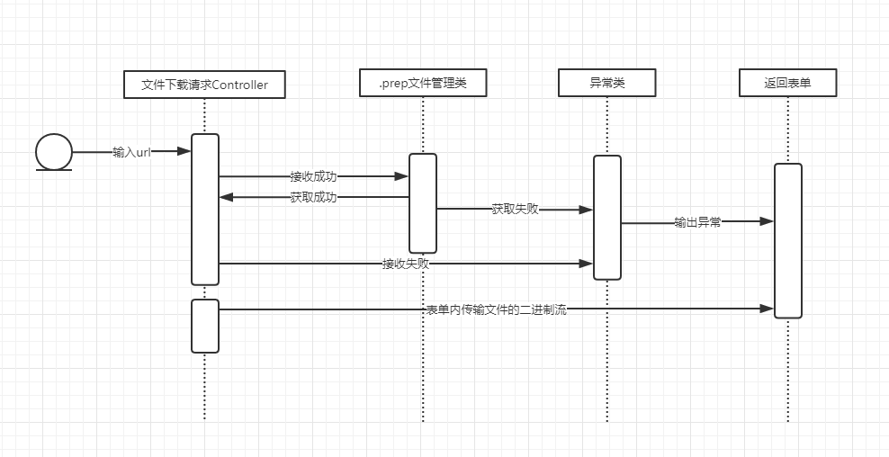

## Dataverse详细设计规约（Detailed Design）

### 1.过程流设计

过程流针对需求规约中的用例图进行了功能点上的剖析，分别对不同功能点的过程流设计进行设计和改进。

- 数据转入.tab

  - 描述：这个Use case负责将各种数据源的数据转换成符合Dataverse处理的数据格式文件——.tab文件
  - 参与者：数据提供者。这个提供者可以是数据库，也可以是任意形式的数据提供来源
  - 前提条件：拥有批量的离散型数据
  - 完成后状态：.tab格式的数据源
  - 过程流：
  - 异常处理：若转换过程中出现问题，则取消本次转换流程

- .tab文件下载

  - 描述：负责tab文件的下载
  - 参与者：数据应用者，该actor负责操作下载的整个流程
  - 前提条件：有.tab文件
  - 完成后条件：出现`test.tab`文件的下载方式
  - 过程流：

  ​

- .xml文件下载

  - 描述：负责xml文件的下载
  - 参与者：数据应用者，该actor负责操作下载的整个流程
  - 前提条件：有.xml文件
  - 完成后条件：出现`test-ddi.xml`文件的下载方式
  - 过程流：

- .xml文件生成

  - 描述：负责xml文件的生成

  - 参与者：数据应用者，控制文件生成的过程

  - 前提条件：拥有.tab文件

  - 完成后条件：在对应的tab, xml, prep 文件夹内含有：`test.tab`， `test-ddi.xml`的三个名字相关联的文件

  - 过程流：

    

  ​

- .prep文件下载

  - 描述：负责prep文件的下载
  - 参与者：数据应用者，该actor负责操作下载的整个流程
  - 前提条件：有.prep文件
  - 完成后条件：出现`test.prep`文件的下载方式
  - 过程流：

- .prep文件生成

  - 描述：负责prep文件的生成
  - 参与者：数据应用者，控制文件生成的过程
  - 前提条件：拥有.tab文件
  - 完成后条件：在对应的tab, xml, prep 文件夹内含有：`test.tab`， `test.prep`的三个名字相关联的文件
  - 过程流：

- tab文件管理

  - 描述：负责tab文件的读取，生成和下载

  - 参与者：数据应用者，数据提供者

  - 前提条件：拥有数据源

  - 完成后条件：在tab文件夹内有tab文件，且能进行正常的访问下载功能。

  - 过程流：

    

  ​

- prep文件管理

  - 描述：负责prep文件的读取，生成和下载

  - 参与者：数据应用者，数据提供者

  - 前提条件：拥有数据源

  - 完成后条件：可以进行prep文件的生成和下载

  - 过程流：

    

- xml文件管理

  - 描述：负责xml文件的读取，生成和下载
  - 参与者：数据应用者，数据提供者
  - 前提条件：拥有数据源
  - 完成后条件：可以进行xml文件的生成和下载
  - 过程流：

- 数据查看

  - 描述：在TwoRavens上查看相关数据信息

  - 参与者：TwoRavens

  - 前提条件：三种文件：`test.tab, test.prep, test-ddi.xml`均存在

  - 完成后条件：在TwoRavens的界面左栏能搜索到变量的相关信息，中央每个变量用一个圆圈表示。

  - 过程流：

    

  ​

- 简要信息查询

  - 描述：在TwoRavens上查看某个元素简要的信息
  - 参与者：TwoRavens
  - 前提条件：三种文件：`test.tab, test.prep, test-ddi.xml`均存在
  - 完成后条件：在TwoRavens的界面左栏能搜索到变量的相关信息，中央每个变量用一个圆圈表示。
  - 过程流：

- 详细信息查询
  - 描述：在TwoRavens上查看某个元素详细的信息
  - 参与者：TwoRavens
  - 前提条件：三种文件：`test.tab, test.prep, test-ddi.xml`均存在
  - 完成后条件：在TwoRavens的界面左栏能搜索到变量的相关信息，中央每个变量用一个圆圈表示。
  - 过程流：

- 图表信息

  - 描述：通过二维图像表示每个变量的数据
  - 参与者：TwoRavens
  - 前提条件：三种文件：`test.tab, test.prep, test-ddi.xml`均存在
  - 完成后条件：在TwoRavens的界面左栏能搜索到变量的相关信息，中央每个变量用一个圆圈表示。

- 数据详细列表

  - 描述：通过详细列表展示每个变量的数据
  - 参与者：TwoRavens
  - 前提条件：三种文件：`test.tab, test.prep, test-ddi.xml`均存在
  - 完成后条件：在TwoRavens的界面左栏能搜索到变量的相关信息，中央每个变量用一个圆圈表示。

- 数据计算

  - 描述：通过点击网页的计算按钮对现有数据进行计算

  - 参与者：TwoRavens

  - 前提条件：三种文件：`test.tab, test.prep, test-ddi.xml`均存在且可以查看对应的变量

  - 完成后条件：生成新的变量表示计算结果

  - 过程流：

    

- 数据提示
  - 描述：当数据计算请求无效时返回无效信息
  - 参与者：TwoRavens
  - 前提条件：在计算过程中出现未知错误，可能是数据本身的问题，也有可能是输入输出的类型不符合数学逻辑。
  - 完成后条件：输出错误信息
- 数据传输和计算
  - 描述：当计算有效时返回该数据
  - 参与者：TwoRavens
  - 前提条件：满足计算的所有要求
  - 完成后条件：生成新的变量代表计算后的结果，变量中含有详细信息。

## 2.类设计

---

### RemoteDataFrameService

*com.monetware.demo*

_public class **RemoteDataFrameSerive**_

系统中关于生成.prep文件的实例

#### 变量

| 种类                    | 变量名                       | 描述            |
| --------------------- | ------------------------- | ------------- |
| private static Logger | dbgLog                    | 获取包           |
| public static String  | LOCAL_TEMP_DIR            | 存放生成的prep文件路径 |
| private static String | RSERVE_HOST               | Rserve的IP地址   |
| private static int    | RSERVE_PORT               | Rserve的端口     |
| private static String | DATAVERSE_R_PREPROCESSING | R脚本的路径        |
| public String         | PID                       | 标记号（暂时无用）     |
| public String         | tempFileNameIn            | 读入的临时文件的名字    |
| public String         | tempFileNameOut           | 输出的临时文件的名字    |

#### 方法

> getFileSize

* public int getFileSize(RConnection c, String targetFilename)

获取文件大小

**返回**

文件大小

**参数**

- RConnection c：R语言连接
- String targetFilename：文件名

**异常**

无

> transferRemoteFile

- public File transferRemoteFile(RConnection c, String targetFilename, String tmpFilePrefix, String tmpFileExt, int fileSize)

传输并获取R语言计算好的结果文件

**返回**

计算结果文件

**参数**

- RConnection c：R语言连接
- String targetFilename：目标文件名
- String tmpFilePrefix：读入文件名
- String tmpFileExt：输出文件名
- int fileSize：文件大小

**异常**

无

> runDataPreprocessing

- public File runDataPreprocessing(String path, String name) throws IOException

执行prep文件生成的主函数

**返回**

最终的结果文件

**参数**

- String path：文件路径
- String name：文件名

**异常**

IOException

> readLocalResource

- private static String readLocalResource(String path)

读取本地资源文件（主要为R语言脚本）

**返回**

字符串形式的R语言脚本

**参数**

- String path：文件路径

**异常**

无

### CreateXML

*com.monetware.xml*

_public class **CreateXML**_

用于生成XML文件

#### 变量

无

#### 方法

> CreateFile

- public String CreateFile(String fileName) throws Exception

用于生成xml文件

**返回**

- 如果创建成功，则返回 "create file successfully!"
- 如果xml文件已经存在，则返回 "xml file already exist!"

**参数**

- String fileName：文件名

**异常**

Exception

