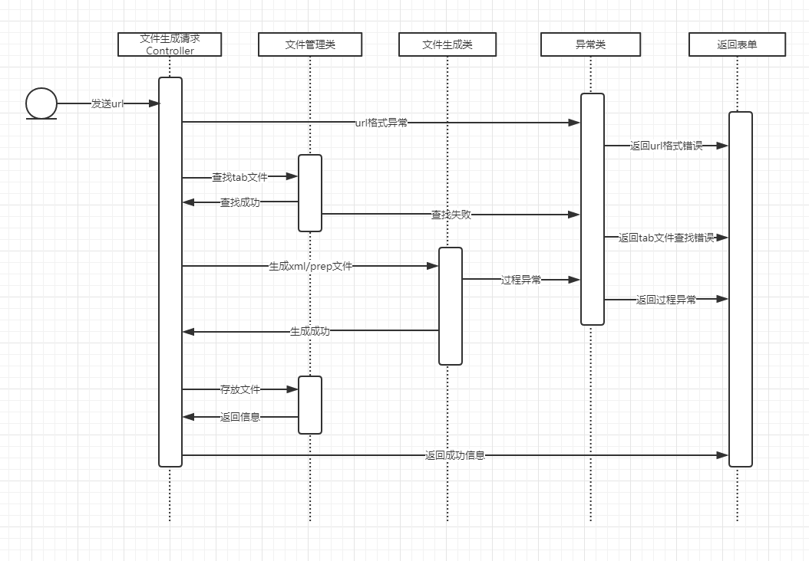

# Dataverse需求规约

## 1. 项目介绍

### 1.1 项目背景

Dataverse是一个开源的Web应用程序，用于共享，保存，引用，探索和分析研究数据。 它有助于将数据提供给其他人，并允许您更容易地复制他人的工作。 研究人员，数据作者，出版商，数据分销商和附属机构都可以获得学术信用和网络知名度。

Dataverse最早是由哈佛大学学生所创建的开源项目，因其标准而全面的数据集表示和公式嵌套规则被很多大学和公司所创建和使用。迄今为止，全球共有30个国家和地区使用总共2473个Dataverse的不同版本,近5万条数据集以及292万的下载量。

其实，Dataverse可以看成在线的数据存储管理仓库。用户把自己要处理的数据转换成相应格式，存储到服务器上，便可以进行各种各样的数据分析和建模。而为了形象地展示数据，提供各种简便的数据处理方式，另一个与之对应的开源项目应运而生：TwoRavens。

TwoRavens是Dataverse开源项目的子项目之一，它是提供了Dataverse的数据展示平台：只要将相关的数据托管在Dataverse上，点击详情按钮，便可以进入到webapp里查看相关数据图像。图像包含了不同变量，并用每个圆圈表示一个变量，圆圈之间的连线表示变量之间的联系。可以选择添加新的变量，进行不同的数据操作合成新的变量等等来进行你想要的所有数据处理方式。

### 1.2 项目目的

由于Dataverse和TwoRavens是相互依赖，彼此相关的项目，再操作中会遇到如下几个问题：

- 需要配置繁杂的Dataverse运行环境。
- 无法根据自身定制合适的Dataverse管理工具。
- 项目太过繁杂庞大很难进行后期的维护和修改。
- Dataverse的主要部分：Java web程序太过老旧，其使用到的servlet、EJB技术已被Spring，Hibernate等新的技术所代替。

为了参与到这个开源项目，为Dataverse开发贡献自己的一份力量，同时为了开发同济大学软件学院自己的数据管理平台，我们参与到此项目的开发改造中。另外，我们此次项目主要目标在于抽离出Dataverse的核心代码转变而成简单明了的轻量级服务处理，无需进行繁杂的配置和源码阅读便可以轻松运行这个数据处理平台。因此，我们将Dataverse有关数据、文件处理的部分抽离出来，删减了无用功能，使用Spring Boot作为新的后台技术栈，让我们的Dataverse更具个性化，更加易于项目的维护管理。

### 1.3 目标人群

- 学生：Dataverse作为全世界知名的开源项目，具有很好的项目参考和借鉴的价值。让学生参与到Dataverse的开发过程中，能有效提高学生对软件工程整个流程的理解，提升学生的项目工程能力、阅读理解代码的能力。
- 合作公司：Dataverse开源平台具有完善的数据展示计算平台，很适合部分企业进行定制化的改造进化。但由于Dataverse本身太过繁杂，不适合单个企业进行维护更新。
- 开源社区贡献者：现如今，很多大学都有了自己的Dataverse管理平台，开发自己版本的Dataverse可以参考其他学校的Datavers项目并提升自己代码的质量和功能。

### 1.4 项目约束

项目需要运行必须经过如下的配置：Rserve环境的配置。Rapache环境的配置。apache服务器配置。鉴于项目运行的配置需求，项目建议在linux环境下安装运行。项目中所用数据都是经过处理后特定的.tab文件中的数据，因此再前期需要自己对数据进行规范处理。此项目暂时只能对离散性数据进行处理，但就所测数据来看离散性数据处理异能应对大多数数据处理需求。

## 2. 项目需求分析

下面给出Dataverse项目的KAOS图来表示项目需求规约：

### 2.1 数据集的创建

把自己需要的数据转换成cvs类型的文件，后缀名改为.tab，放置到名字为tab的文件夹下。

### 2.2 数据集的管理

数据集管理可以分为3个部分：prep文件管理、tab文件管理和xml文件管理。其中prep、xml文件的生成都要依赖于tab文件；而tab文件又是由第一部分完成的，所以用例间的关系如图所示。而最后，运行TwoRavens的时候会涉及到三个文件的下载。这些统统都是Dataverse的文件管理内容。

### 2.3 数据的展示

数据的展示全部交由TwoRavens实现。显示数据分为两个部分：数据查看和数据计算。数据查看是指基于现有数据的查看，其中包括目录上的简要信息，点击单个集合的数据详细信息——其中有两种形式：图表形式和详细数据展示。
而数据计算方面，分为数据计算成功和失败两个情况。计算成功代表所有计算步骤均符合数学要求，会得到新的变量和相关数据；计算失败代表再某个环节出现了问题，此时应当由提示信息。

## 3. 用例分析

### 3.1 用例图

### 3.2 用例图说明

- 数据转入.tab

  - 描述：这个Use case负责将各种数据源的数据转换成符合Dataverse处理的数据格式文件——.tab文件
  - 参与者：数据提供者。这个提供者可以是数据库，也可以是任意形式的数据提供来源
  - 前提条件：拥有批量的离散型数据
  - 完成后状态：.tab格式的数据源
  - 过程流：
  - 异常处理：若转换过程中出现问题，则取消本次转换流程

- .tab文件下载

  - 描述：负责tab文件的下载
  - 参与者：数据应用者，该actor负责操作下载的整个流程
  - 前提条件：有.tab文件
  - 完成后条件：出现`test.tab`文件的下载方式
  - 过程流：

  ​

- .xml文件下载

  - 描述：负责xml文件的下载
  - 参与者：数据应用者，该actor负责操作下载的整个流程
  - 前提条件：有.xml文件
  - 完成后条件：出现`test-ddi.xml`文件的下载方式
  - 过程流：

- .xml文件生成

  - 描述：负责xml文件的生成

  - 参与者：数据应用者，控制文件生成的过程

  - 前提条件：拥有.tab文件

  - 完成后条件：在对应的tab, xml, prep 文件夹内含有：`test.tab`， `test-ddi.xml`的三个名字相关联的文件

  - 过程流：

    

  ​

- .prep文件下载

  - 描述：负责prep文件的下载
  - 参与者：数据应用者，该actor负责操作下载的整个流程
  - 前提条件：有.prep文件
  - 完成后条件：出现`test.prep`文件的下载方式
  - 过程流：

- .prep文件生成

  - 描述：负责prep文件的生成
  - 参与者：数据应用者，控制文件生成的过程
  - 前提条件：拥有.tab文件
  - 完成后条件：在对应的tab, xml, prep 文件夹内含有：`test.tab`， `test.prep`的三个名字相关联的文件
  - 过程流：

- tab文件管理

  - 描述：负责tab文件的读取，生成和下载

  - 参与者：数据应用者，数据提供者

  - 前提条件：拥有数据源

  - 完成后条件：在tab文件夹内有tab文件，且能进行正常的访问下载功能。

  - 过程流：

    

  ​

- prep文件管理

  - 描述：负责prep文件的读取，生成和下载

  - 参与者：数据应用者，数据提供者

  - 前提条件：拥有数据源

  - 完成后条件：可以进行prep文件的生成和下载

  - 过程流：

    

- xml文件管理

  - 描述：负责xml文件的读取，生成和下载
  - 参与者：数据应用者，数据提供者
  - 前提条件：拥有数据源
  - 完成后条件：可以进行xml文件的生成和下载
  - 过程流：

- 数据查看

  - 描述：在TwoRavens上查看相关数据信息

  - 参与者：TwoRavens

  - 前提条件：三种文件：`test.tab, test.prep, test-ddi.xml`均存在

  - 完成后条件：在TwoRavens的界面左栏能搜索到变量的相关信息，中央每个变量用一个圆圈表示。

  - 过程流：

    

  ​

- 简要信息查询

  - 描述：在TwoRavens上查看某个元素简要的信息
  - 参与者：TwoRavens
  - 前提条件：三种文件：`test.tab, test.prep, test-ddi.xml`均存在
  - 完成后条件：在TwoRavens的界面左栏能搜索到变量的相关信息，中央每个变量用一个圆圈表示。
  - 过程流：

- 详细信息查询
  - 描述：在TwoRavens上查看某个元素详细的信息
  - 参与者：TwoRavens
  - 前提条件：三种文件：`test.tab, test.prep, test-ddi.xml`均存在
  - 完成后条件：在TwoRavens的界面左栏能搜索到变量的相关信息，中央每个变量用一个圆圈表示。
  - 过程流：

- 图表信息

  - 描述：通过二维图像表示每个变量的数据
  - 参与者：TwoRavens
  - 前提条件：三种文件：`test.tab, test.prep, test-ddi.xml`均存在
  - 完成后条件：在TwoRavens的界面左栏能搜索到变量的相关信息，中央每个变量用一个圆圈表示。

- 数据详细列表

  - 描述：通过详细列表展示每个变量的数据
  - 参与者：TwoRavens
  - 前提条件：三种文件：`test.tab, test.prep, test-ddi.xml`均存在
  - 完成后条件：在TwoRavens的界面左栏能搜索到变量的相关信息，中央每个变量用一个圆圈表示。

- 数据计算

  - 描述：通过点击网页的计算按钮对现有数据进行计算

  - 参与者：TwoRavens

  - 前提条件：三种文件：`test.tab, test.prep, test-ddi.xml`均存在且可以查看对应的变量

  - 完成后条件：生成新的变量表示计算结果

  - 过程流：

    

- 数据提示
  - 描述：当数据计算请求无效时返回无效信息
  - 参与者：TwoRavens
  - 前提条件：在计算过程中出现未知错误，可能是数据本身的问题，也有可能是输入输出的类型不符合数学逻辑。
  - 完成后条件：输出错误信息
- 数据传输和计算
  - 描述：当计算有效时返回该数据
  - 参与者：TwoRavens
  - 前提条件：满足计算的所有要求
  - 完成后条件：生成新的变量代表计算后的结果，变量中含有详细信息。
