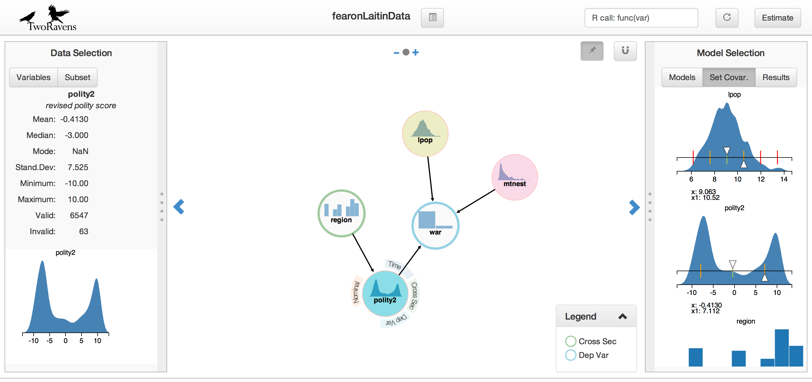

## Introduction

**TwoRavens** is a system of interlocking statistical tools for data exploration, analysis, and meta-analysis. The first to be released is an interface for quantitative analysis, that allows users at all levels of statistical expertise to explore their data, describe their substantive understanding of the data, and appropriately construct statistical models. This integrates with Dataverse ([Project](http://dataverse.org/)|[GitHub](https://github.com/IQSS/dataverse)) and Zelig ([Project](http://zeligproject.org/)|[GitHub](https://github.com/IQSS/Zelig)), through a portable, lightweight, browser-based and gesture-driven interface, allowing users to run statistical models available in Zelig on data archived in Dataverse.

Project page and publications available at: [http://2ra.vn](http://2ra.vn/)

To demo TwoRavens using replication data from Fearon and Laitin's 2003 article, *Ethnicity, Insurgency, and Civil War*: <https://beta.dataverse.org/dataexplore/gui.html?dfId=37&>



## What we did

The data that **TwoRavens** used all comes from Dataverse. So we are trying to develop an independent backend, which can handle, analyze the origin data, and send the data to TwoRavens.

## How to build

###  Environment Requirements

- Java SE Development Kit 8
- R 3.2.2 or higher
- R packages
  - Rserve 1.7.3 or higher
  - [Other R packages](https://github.com/FoxerLee/TwoRavens-Backend/Doc/package-versions.txt)

###  Get the Project

- get the project from github

> git clone https://github.com/FoxerLee/TwoRavens-Backend.git

### Import the Project to IDE

Open the pom.xml file with IntelliJ IDEA. It will automatically import the required dependencies.

### Build the Project

```shell
$ cd TwoRavens-Backend
$ mvn clean package
```

You can also use IDEA to create jar file or war file.

 ## How to run

```shell
$ java -jar  filename.jar
```

If you build war file,  you can simply put the war file into tomcat.

## How to use

We packaged 5 http interfaces, 